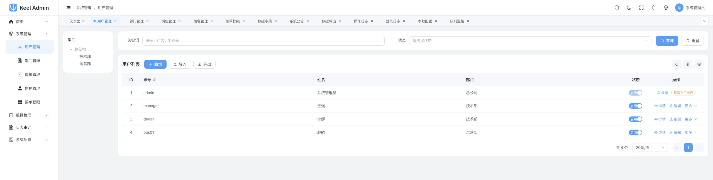

<div align="center">


# Keel Admin

**开箱即用的多端后台脚手架**

登录鉴权、完整 RBAC、系统管理、日志审计、异步任务与员工移动端均已落地。
行业业务从清晰、稳定的工程底座上开始开发。

[](https://github.com/bryce988/keel-admin)
[](LICENSE)
[](https://www.php.net/)
[](https://www.workerman.net/webman)
[](https://vuejs.org/)

[在线预览](http://43.143.249.52:8080) · [快速开始](#快速开始) · [核心能力](#核心能力) · [项目文档](PROJECT.md) · [设计规范](DESIGN.md)

[GitHub](https://github.com/bryce988/keel-admin) · [Gitee](https://gitee.com/yewang_top/keel-admin)

</div>



## 项目定位

Keel 是一套面向多端应用的后台管理脚手架。启动项目即可获得能登录、能管权限、能查日志、
能运行异步任务的管理后台，开发者可以直接增加业务模块。

框架已经包含五端入口、八个系统管理模块、五种通用页型模板和员工移动端 App。
行业模型、业务流程与演示数据保持分离，演示数据可一键清理。

| 设计重点 | Keel 的实现 |
|---|---|
| 多端架构 | `admin`、`staff`、`client`、`open`、`internal` 独立路由、中间件与异常响应 |
| 权限边界 | 功能权限、数据权限、字段权限相互独立，服务端默认拒绝未声明权限的接口 |
| 开发效率 | 列表、树表、主从、表单、详情五种模板，共用查询、表格、抽屉与字典组件 |
| 运行能力 | webman 常驻内存，队列消费者与定时任务随服务一起运行 |

## 快速开始

开发环境只需要 Docker，无需在本机安装 PHP、Node、MySQL 或 Redis。

```bash
git clone https://github.com/bryce988/keel-admin.git
cd keel-admin

cp .env.example .env
docker compose up -d
```

首次启动会构建镜像并安装依赖，通常需要 2–3 分钟。

| 服务 | 地址 | 说明 |
|---|---|---|
| 管理后台 | http://localhost:5173 | `admin` / `admin123` |
| 后端探测 | http://localhost:8787/admin/ping | 返回服务存活状态 |

在线预览地址为 http://43.143.249.52:8080 。使用 `manager` / `demo123456` 登录，
可以查看部门主管的数据权限效果：菜单和用户数据会根据角色自动收敛。

<details>
<summary><strong>查看日志与常用命令</strong></summary>

```bash
# 查看运行状态
docker compose ps
docker compose logs -f server
docker compose logs -f web

# 开发与维护
docker compose restart server
docker compose exec server php start.php reload
docker compose exec server php scripts/install.php

# 提交前检查
docker compose exec -T web npm run check
docker compose exec -T server composer check

# 进入数据库
docker compose exec mysql mysql -ukeel -pkeel123456 keel

# 停止服务并清空本地数据卷
docker compose down -v
```

`scripts/install.php` 只会补建默认管理员，账号已存在时会跳过。修改普通 PHP 代码时调试模式会自动
reload；修改 `config/`、自定义进程或依赖后需要重启 server 容器。

</details>

## 核心能力

所有 v1.0 功能均有实际页面和接口，不包含只有菜单的占位模块。

| 模块 | 已实现能力 |
|---|---|
| 登录与工作区 | 图形验证码、JWT、失败锁定、菜单下发、菜单搜索、多页签、面包屑、深浅色主题 |
| 界面布局 | 经典、混合、分栏三种导航布局，支持侧栏收起、通知中心与偏好持久化 |
| 权限体系 | RBAC1 角色继承、RBAC2 职责分离、五种数据范围、字段脱敏、权限点拦截 |
| 系统管理 | 用户、部门、岗位、角色、菜单权限、字典、参数、登录与操作日志 |
| 数据与任务 | 流式导入导出、异步导出中心、系统公告、队列监控、定时清理 |
| 个人中心 | 资料维护、修改密码、换绑手机、个人登录记录 |
| 开发模板 | 标准列表、树表联动、主从、表单、详情五种页型，仅在开发环境注册 |
| 员工移动端 | 同账号体系登录、工作台、公告收件箱、未读提醒、资料与头像维护 |

## 架构与技术栈

| 层级 | 技术 |
|---|---|
| 管理后台 | Vue 3、TypeScript、Vite 5、Element Plus、Pinia |
| 员工移动端 | uni-app、Vue 3、HBuilderX |
| 服务端 | PHP 8.4+、webman 2.x、Eloquent、Redis |
| 数据存储 | MySQL 8.0+ |

### 多端入口

五个入口共用基础设施和领域能力，并保留独立的接口边界：

```text
管理后台 admin   ─┐
员工应用 staff   ─┤
C 端应用 client  ─┼─→ common 共享能力 ─→ MySQL / Redis / Queue
开放平台 open    ─┤
内部服务 internal ─┘
```

员工端复用管理端的账号、令牌和权限点，接口独立位于 `/staff/v1/*`。其他端也分别维护自己的
路由、中间件与异常响应；新增端时无需改动整体架构。

### 权限模型

```text
用户 ──多对多── 角色 ──多对多── 权限点 ──→ 菜单 / 按钮 / 接口 / 数据
                 └──→ 数据范围：全部 / 本部门及下属 / 本部门 / 仅本人 / 自定义
```

权限定义、角色授权、用户分配三层职责分开。前端的 `v-permission` 用于收敛界面，
服务端路由上的权限声明负责真正拦截请求；未声明权限点的受保护接口默认返回 403。

### 目录结构

```text
keel-admin/
├── web/                 管理后台前端
├── staff/               员工移动端，详见 staff/README.md
├── server/              webman 后端
│   └── app/
│       ├── admin/       管理后台接口
│       ├── staff/       员工端接口
│       ├── client/      C 端接口
│       ├── open/        开放平台接口
│       ├── internal/    内部接口
│       ├── common/      多端共享能力
│       ├── middleware/  静态资源中间件
│       ├── process/     HTTP 与定时任务进程
│       └── queue/       异步任务消费者
├── docs/                数据库、接口与实施记录
├── docker/              开发与生产容器配置
├── DESIGN.md            界面规范
└── PROJECT.md           完整项目文档
```

`staff/` 是 HBuilderX 工程，不参与 Docker Compose 和 CI；其余部分均可在容器中构建。

## 开发指南

项目约定和详细设计已经拆分到独立文档，README 只保留启动入口。

| 文档 | 内容 |
|---|---|
| [PROJECT.md](PROJECT.md) | 架构、权限、多端划分、页型规范、开发红线与里程碑 |
| [DESIGN.md](DESIGN.md) | 颜色、排版、间距、组件和页面设计规范 |
| [docs/api.md](docs/api.md) | 接口契约、状态码与错误响应 |
| [docs/database.md](docs/database.md) | 表结构与数据关系 |
| [staff/README.md](staff/README.md) | 员工移动端运行与打包 |
| [CHANGELOG.md](CHANGELOG.md) | 版本变更记录 |

新增功能时请遵守三条基础约定：

1. 写接口必须声明权限点，并记录操作日志。
2. 数据权限由模型全局 Scope 注入，业务查询不要重复拼接部门条件。
3. 新页面使用 `SearchForm`、`ProTable`、`FormDrawer` 和现有页型模板保持体验一致。

<details>
<summary><strong>不用 Docker，在本机直接运行</strong></summary>

### 环境要求

| 组件 | 版本 | 说明 |
|---|---|---|
| PHP | 8.4+ | 需要 `pcntl`、`posix`、`pdo_mysql`、`sockets`、`zip`、`redis`、`mbstring`、`curl`、`openssl`、`dom` |
| Composer | 2.x | 安装 PHP 依赖 |
| MySQL | 8.0+ | 使用 `utf8mb4_0900_ai_ci`，不支持 MySQL 5.7 |
| Redis | 6+ | 缓存、限流和队列的必需服务 |
| Node.js | 20+ | 仅管理后台前端需要 |

`ext-redis`（phpredis）是队列插件的硬依赖。可使用 `pecl install redis` 安装；缓存层仍使用
predis，两者同时存在。Windows 下 webman 只能单进程调试，可使用 `server/windows.bat`。

### 1. 设置环境变量

项目本身不解析 `.env` 文件，本机直跑时需要将变量注入当前 shell。不要直接 `source .env`，
其中的行内注释会被一起当作值。

```bash
export APP_ENV=dev APP_DEBUG=true
export APP_URL=http://127.0.0.1:8787
export DB_HOST=127.0.0.1 DB_PORT=3306 DB_DATABASE=keel DB_USERNAME=root DB_PASSWORD=你的密码
export REDIS_HOST=127.0.0.1 REDIS_PORT=6379 REDIS_PASSWORD=
export JWT_SECRET=$(openssl rand -hex 32)
```

`JWT_SECRET` 至少需要 32 字节，生产环境必须固定保存；更换它会让所有现有登录令牌失效。

### 2. 创建数据库

```sql
CREATE DATABASE keel DEFAULT CHARSET utf8mb4 COLLATE utf8mb4_0900_ai_ci;
```

### 3. 启动后端

```bash
cd server
composer install

php scripts/migrate.php
php scripts/install.php
php scripts/seed.php --demo
php start.php start
```

`migrate.php` 会根据 `server/database/schema.sql` 幂等建表和补列。服务启动后，访问
http://127.0.0.1:8787/admin/ping 应得到 `{"pong":true,"app":"admin"}`。

常用进程命令：

```bash
php start.php reload
php start.php restart
php start.php stop
php start.php status
```

确保 `server/runtime/` 和 `server/public/uploads/` 对运行用户可写。

### 4. 启动管理后台

```bash
cd web
npm ci
VITE_PROXY_TARGET=http://127.0.0.1:8787 npm run dev
```

本机直跑时必须指定 `VITE_PROXY_TARGET`；其默认值 `http://server:8787` 只在 Docker 网络中有效。

### 5. 运行员工移动端

使用 HBuilderX 打开 `staff/` 目录运行或云打包，详细步骤见 [staff/README.md](staff/README.md)。

</details>

## 部署

```bash
git clone https://gitee.com/yewang_top/keel-admin.git /opt/keel
cd /opt/keel

cp .env.example .env
vi .env
docker compose -f docker-compose.prod.yml up -d --build
```

后续更新使用：

```bash
./scripts/deploy.sh
```

生产编排会将前端构建为静态文件并交给 nginx，只暴露一个 HTTP 端口，默认是 `8080`；
MySQL 与 Redis 不暴露宿主机端口。部署前请更换数据库密码和 JWT 密钥。网络受限时可在 `.env`
中设置 `APK_MIRROR` 与 `COMPOSER_MIRROR`。

原生部署时，使用 systemd 或 supervisor 守护 `php start.php start -d`，并参考
`docker/nginx/default.conf` 配置端前缀转发、XFF、`/internal/` 拒绝和 `/uploads/` 静态资源规则。

## 项目进度

| 阶段 | 状态 | 主要成果 |
|---|:---:|---|
| M1 框架搭建 | ✅ | 登录闭环、动态路由、权限指令、通用组件、数据权限 Scope |
| M2 系统管理 | ✅ | 八个系统模块、导入导出、权限矩阵、操作日志 |
| M3 工程能力 | ✅ | 五种页型模板、个人中心、队列与定时任务、空状态与骨架屏 |
| M4 联调加固 | ✅ | 54 项验收断言、30 分钟压测、断线重连与部署验证 |
| M5 员工移动端 | ✅ | 登录、工作台、公告消息、个人资料、跨域与续期机制 |
| 二期 | 规划中 | 面向终端用户的 C 端业务接口与开放平台 |

详细里程碑和实测结论见 [PROJECT.md](PROJECT.md)；M2 的实施记录见
[docs/roadmap-m2.md](docs/roadmap-m2.md)。

## 参与贡献

GitHub 与 Gitee 内容保持一致，可就近提交 Issue 或 Pull Request。提交前请阅读
[CONTRIBUTING.md](CONTRIBUTING.md)，提交信息使用 `type(scope): subject`。

- Bug 与功能建议：[GitHub Issues](https://github.com/bryce988/keel-admin/issues)
- 安全问题：按 [SECURITY.md](SECURITY.md) 提供的私密渠道报告
- 使用与二次开发咨询：1306811834@qq.com

## 开源协议

Keel 使用 [MIT License](LICENSE)，允许商业使用和闭源二次开发。
